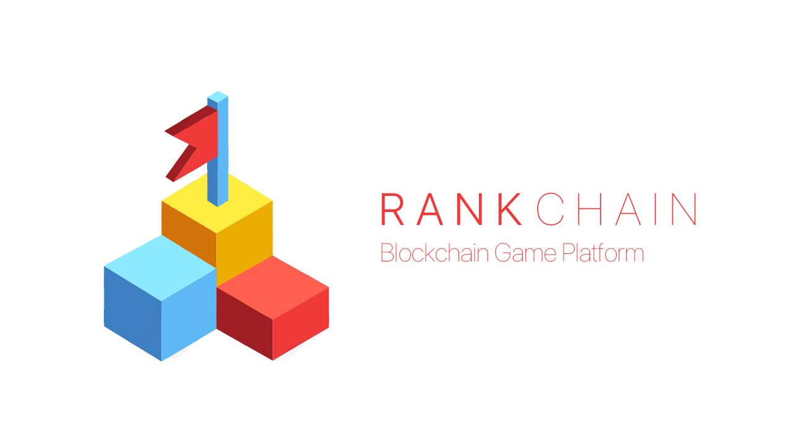

# RankChain

### **RankChain?**

A blockchain platform which encourages users to compete each other and provides game-independent currencies. As the name implies, this platform is most suitable for score based games such as FlappyBird or Stack(from ketchapp).

### **RankChain SDK**

We've made a SDK that enables to make a blockchain games. 
It contains following features:

- **User Auth**:
As a platform, player data should be shared between games. SDK performs storing/retriving private key from the server. Every key will be stored by endpoint encryption and server never knows original data even though it stores bunch of keys.
- **Challenges**

    Here's the main part of the our project. SDK provides APIs to create a new challenge based on user highscore. Users can create a challenge if they have strong confident with their score. or challenge to other's highscore if the reward is attractive enough. So, this is how RankChain SDK helps game developers to make a game ecosystem.

- **Blockchain Inventory**

    Most of games require a database to store/retrive the its progress. And also, Storing/Retriving data is one of the most strongest part of the blockchain. So, we provide it!

- **Achievements**

    Same concept as inventory, but Achievements can be shown to other users. You can save achievements(trophies) on the blockchain with a single line of code.

- **In game currency**

    To make this ecosystem works, game should provide benefits which users can acquire by Rank Token. RankChain has its token which named as '(RT)RankToken'. This token will be shared between games regardless regardless publisher of the game. So users can purchase item from game A, even though the RankToken was earned from game B. It makes RankToken more attractive.

    As a token, RankChain also includes basic tokens stuffs. You can query account balances or transfer tokens to other account with SDK.

### **Goal**

- **Seamless experience for both developers and users.**
Blockchain stuffs, sometimes can be really confusing and scaring to both developers and users. The one of our major goal is, making a smooth blockchain experience. Users who don't have  blockchain experience still can play the game and enjoy our competition system.
- **Provides most demanded SDK**

    Unity is a most popular game engine in the industries. However, most of the blockchain ecosystems never provide a Unity SDK as a first-party. This is a great help to encourage game developers to integrate their games to RankChain. 

- **Most practical usage of blockchain**

    Mobile game is most demanded industry for both real-world and blockchain dApps. 

### Our Next Steps

- More SDK on More Platforms
- SDK documentation
- Publish our games to real world (Google Play)
